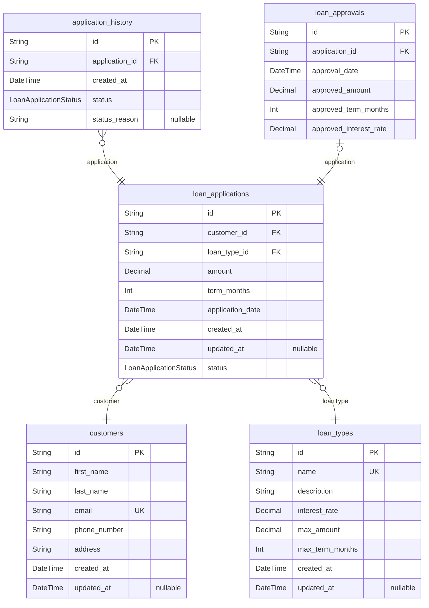

# Loan Application Processing Service ERD
> Generated by [`prisma-markdown`](https://github.com/samchon/prisma-markdown)

- [default](#default)

## default

### `customers`

**Properties**
  - `id`: 
  - `first_name`: 
  - `last_name`: 
  - `email`: 
  - `phone_number`: 
  - `address`: 
  - `created_at`: 
  - `updated_at`: 

### `loan_applications`

**Properties**
  - `id`: 
  - `customer_id`: 
  - `loan_type_id`: 
  - `amount`: 
  - `term_months`: 
  - `application_date`: 
  - `created_at`: 
  - `updated_at`: 
  - `status`: 

### `application_history`

**Properties**
  - `id`: 
  - `application_id`: 
  - `created_at`: 
  - `status`: 
  - `status_reason`: 

### `loan_approvals`

**Properties**
  - `id`: 
  - `application_id`: 
  - `approval_date`: 
  - `approved_amount`: 
  - `approved_term_months`: 
  - `approved_interest_rate`: 

### `loan_types`

**Properties**
  - `id`: 
  - `name`: 
  - `description`: 
  - `interest_rate`: 
  - `max_amount`: 
  - `max_term_months`: 
  - `created_at`: 
  - `updated_at`: 